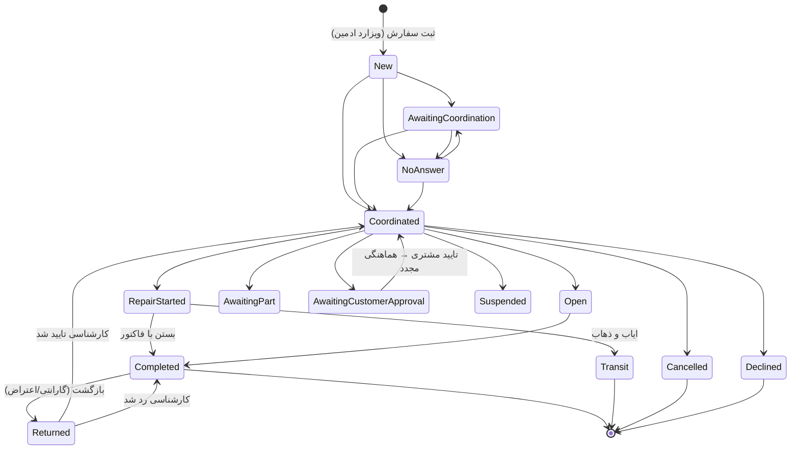

# مستند کامل چرخه حیات سفارش — از ثبت تا پایان

آخرین به‌روزرسانی: ۱۴۰۵/۰۵/۲۹ — منطبق با کد پنل (Laravel). این سند مرجعِ عملکردی برای اپراتورها، ادمین‌ها و تیم‌های توسعه است.

---

## ۱) نمای کلی

(نمودار ساده‌شده است — جدول کامل گذارها در بخش ۳.)

---

## ۲) ثبت سفارش — ویزارد ادمین (`admin/crm/orders/create/new`)

ویزارد ۳ مرحله‌ای: **محل و دستگاه‌ها → مشتری و آدرس → مرور و ثبت**.

### ۲-۱) محل سرویس
- **استان و شهر اجباری** است (پیش‌فرض استان: تهران). شهر با dropdown سرچ‌دار از AJAX بارگذاری می‌شود.
- **منطقه فقط برای شهرهایی که منطقه دارند** (مثل ۲۲ منطقه تهران) و **فقط برای سفارش (نه لید)** اجباری است — در مرحله مشتری انتخاب می‌شود. شهرهای بدون منطقه هیچ الزامی ندارند.
- **آدرس متنی** برای سفارش اجباری است؛ برای لید خیر. با انتخاب مشتری قدیمی، آدرس آخرین سفارشش خودکار پیش‌پر می‌شود.

### ۲-۲) پوشش خدمات شهر (فیلتر خودکار دستگاه)
به محض انتخاب شهر، لیست «نوع دستگاه» برای **سفارش** محدود می‌شود به دستگاه‌هایی که حداقل یک تکنسین فعال با **تگ صریح همان شهر** مهارتشان (تگ دستگاه) را دارد:

| وضعیت داده | نتیجه |
|---|---|
| تکنسین فعالِ تگ‌خورده در شهر با تگ دستگاه | فقط همان دستگاه‌ها باز می‌شوند (مثال مشهد: فقط لباسشویی) |
| تکنسین تگ‌خورده در شهر **بدون** تگ دستگاه | همه‌کاره — همه دستگاه‌ها باز |
| هیچ تکنسینی با تگ آن شهر | هیچ دستگاهی — بنر «فقط ثبت لید ممکن است» |
| هیچ تکنسین فعالی در کل سیستم تگ شهر ندارد | محدودیت غیرفعال + بنر هشدار (قفل سراسری ممنوع) |

- همین قاعده **سمت سرور هم** اجرا می‌شود (نمی‌توان با دستکاری فرم دور زد).
- تغییر شهر یا روشن‌کردن «قابل سفارش»، دستگاهِ خارج از پوشش را خودکار پاک می‌کند.
- **لید کاملاً مستثناست** — همه دستگاه‌ها برای لید باز است.

### ۲-۳) دستگاه و ایراد
- نوع سفارش: **تعمیر** یا **نصب**؛ برند و دستگاه اجباری.
- **ایراد دستگاه** (multi-select از لیست تنظیمات) برای سفارش حداقل یک مورد اجباری است + شرح آزاد اختیاری.
- **چند دستگاه در یک ثبت**: هر دستگاه اضافه یک سفارش (یا لید) جداگانه با مشتری/آدرس مشترک می‌سازد.

### ۲-۴) لید (تماس غیرقابل سفارش)
تَوگل «قابل سفارش» خاموش → رکورد `is_lead=true` با **دلیل عدم سفارش** (اجباری از لیست) و یادداشت. لید پیامک نمی‌گیرد، فاکتور نمی‌گیرد، در آمار سفارش نمی‌آید و محدودیت پوشش/آدرس ندارد. شماره ثابت (با کد شهر) هم برای مشتری لید پذیرفته است.

### ۲-۵) مشتری
- جستجو با موبایل/نام یا ثبت مشتری جدید (اگر موبایل تکراری بود، همان مشتری قبلی استفاده و فیلدهای خالی‌اش تکمیل می‌شود). موبایل خودکار نرمال می‌شود (رقم فارسی، +۹۸ و…).
- «نحوه آشنایی» اجباری. مشتری **بلاک‌شده** نمی‌تواند سفارش جدید بگیرد.

### ۲-۶) نتیجه ثبت
- سفارش با وضعیت **«جدید»**، بدون تکنسین ساخته می‌شود + لاگ «ثبت اولیه سفارش از ویزارد».
- پیامک `order_created` به مشتری (فقط سفارش، نه لید).
- سفارش‌های سایت/ووکامرس هم از مسیر sync وارد همین چرخه می‌شوند.

---

## ۳) وضعیت‌ها و گذارها

### ۳-۱) جدول وضعیت‌ها

| وضعیت | برچسب | گروه | نهایی؟ |
|---|---|---|---|
| `new` | جدید | در انتظار | ✗ |
| `awaiting_coordination` | در انتظار هماهنگی | در انتظار | ✗ |
| `no_answer` | مشتری پاسخگو نیست | در انتظار | ✗ |
| `coordinated` | هماهنگ شده | در حال انجام | ✗ |
| `repair_started` | شروع تعمیر | در حال انجام | ✗ |
| `open` | باز شده (انتقال به تعمیرگاه) | در انتظار | ✗ |
| `awaiting_part` | در انتظار قطعه | در انتظار | ✗ |
| `awaiting_customer_approval` | در انتظار تأیید مشتری | در انتظار | ✗ |
| `suspended` | معلق | در انتظار | ✗ |
| `completed` | انجام کار | پایان یافته | ✓ |
| `transit` | ایاب و ذهاب | پایان یافته | ✓ |
| `cancelled` | کنسل شده | پایان یافته | ✓ |
| `declined` | رد شده (تکنسین) | پایان یافته | ✓ |
| `returned` | برگشتی گارانتی | پایان یافته | ✗ (میانی) |

### ۳-۲) قواعد گذار
- **فاز هماهنگی** (جدید/در انتظار هماهنگی/پاسخگو نیست/هماهنگ شده): نتیجه تماس ثبت می‌شود؛ `no_answer` فقط از «نتیجه تماس» ست می‌شود نه دستی توسط تکنسین.
- **خوشه کاری غیرنهایی** (هماهنگ‌شده/شروع تعمیر/باز/انتظار قطعه/انتظار تأیید مشتری/معلق) **کاملاً به هم متصل است** — تکنسین می‌تواند آزادانه به عقب برگردد (مثلاً بعد از تأیید مشتری، دوباره «هماهنگ شده» و زمان مراجعه جدید). تنظیم زمان مراجعه در کل این خوشه مجاز است.
- **وضعیت‌های نهایی** (انجام کار/ایاب و ذهاب/کنسل/رد) **قفل‌اند** — خروج فقط با «بازگشت سفارش» توسط ادمین. «رد شده» را ادمین می‌تواند به «کنسل» تبدیل کند.
- **کنسل/رد** نیازمند انتخاب دلیل از لیست ثابت (۱۲ دلیل — مثل «با هزینه اعلام‌شده موافقت نشد»، «فقط استعلام هزینه می‌خواستند» و…).
- تکنسین لیست گذارهای مجازش را از API می‌گیرد (اشتراک گذارهای مجاز × لیست سفید تکنسین؛ «کنسل» فقط ادمین).

---

## ۴) تخصیص تکنسین

سفارش بدون تکنسین ثبت می‌شود؛ تخصیص به سه روش:

1. **دستی** — اپراتور با permission «تخصیص تکنسین» از صفحه سفارش.
2. **پیشنهاد هوشمند** (permission: view-tech-suggestions) — امتیازدهی وزنی: سفارش باز کمتر (۳۰)، بدهی کمتر (۲۵)، رضایت (۲۰)، نرخ کنسلی (۱۰)، فعالیت اخیر (۱۰)، سرعت پاسخ (۵). وزن‌ها از تنظیمات قابل تغییرند. اگر پیشنهادی نبود، «تشخیص» می‌گوید چرا (شهر/منطقه/برند/دستگاه/ظرفیت/نوع خدمت).
3. **توزیع خودکار** — دستور زمان‌بندی‌شده با استراتژی‌های تنظیم‌شده.

**فیلترهای سخت (در همه روش‌ها):** تکنسین فعال + آماده دریافت + ظرفیت باز (max_order) + تطبیق تگ شهر (خالی=همه‌جا، فقط در تخصیص) + تگ منطقه (اگر برای آن شهر منطقه تگ کرده، سفارش باید در همان مناطق باشد) + تگ برند/دستگاه (خالی=همه) + **نوع خدمت** (تعمیر/نصب — پروفایل خالی = حذف از پیشنهاد).

پس از تخصیص: پیامک به مشتری (`order_assigned`) و تکنسین (`order_assigned_tech`) + پوش به اپ تکنسین.

---

## ۵) هماهنگی و مراجعه

- زمان مراجعه: تاریخ + یکی از ۴ بازه (۹–۱۲، ۱۲–۱۵، ۱۵–۱۸، ۱۸–۲۱) — از پنل یا اپ تکنسین (تقویم).
- **SLA**: نزدیک شدن مهلت → پیامک هشدار به تکنسین (`tech_sla_warning` یک ساعت مانده، `tech_sla_due` سر مهلت).
- تاریخچه کامل وضعیت‌ها (append-only) با نام عامل ثبت می‌شود؛ تکنسین فقط گذر وضعیت‌ها + یادداشت‌های خودش را می‌بیند (یادداشت اپراتور و ردیف‌های بدون تغییر وضعیتِ دیگران برایش حذف می‌شود).

---

## ۶) در طول اجرا

- **انتقال به تعمیرگاه (باز شده):** تکنسین «رسید انتقال» ثبت می‌کند → پیامک رسید به مشتری.
- **پیش‌فاکتور (برآورد قیمت):** از «شروع تعمیر» به بعد و تا قبل از بسته‌شدن مجاز است (نه در فاز هماهنگی، نه بعد از نهایی) — با پیامک لینک برای مشتری؛ با صدور فاکتور نهایی، پیش‌فاکتورهای باز «تبدیل‌شده» علامت می‌خورند.
- اپ تکنسین شماره موبایل **و ثابت** مشتری، آدرس کامل (استان/شهر/منطقه/متن) و توضیحات را می‌بیند.
- **گیت آموزش:** تکنسینی که دوره آموزشی را کامل نکرده، API و وب پنلش (به جز آموزش/پروفایل) قفل است.

---

## ۷) بستن سفارش — حالت‌های پایان

### ۷-۱) انجام کار (Completed) با فاکتور
تکنسین (اپ/پنل) یا ادمین می‌بندد. الزامات:
- **جمع کل صورت‌حساب (price_customer)** — نباید کمتر از هزینه قطعات باشد (مگر پیش‌نویس).
- هزینه قطعات، اجرت، ایاب و ذهاب، تخفیف (اختیاری) — `total_invoice = price_customer − cost_price`.
- **توضیحات فاکتور** (متن قابل نمایش به مشتری — همان گزارش کار تکنسین) اجباری، حداقل ۵ کاراکتر (اپ تکنسین: حداقل ۱۵).
- **روش دریافت وجه:** «نقدی (در محل)» یا «اعتباری (پرداخت آنلاین)». اگر بستانکاری تکنسین از شرکت به سقف (پیش‌فرض ۱۰,۰۰۰,۰۰۰ تومان) رسیده باشد، «اعتباری» قفل است و سرور هم انتخاب آنلاین را رد می‌کند — فاکتور نقدی ثبت می‌شود.
- عکس دستگاه (در اپ).

نتیجه: وضعیت «انجام کار» + **صدور خودکار فاکتور** (بخش ۸) + پیامک فاکتور به مشتری.

### ۷-۲) پیش‌نویس (save_as_draft)
تکمیل بدون صدور فاکتور — برای وقتی مبلغ هنوز قطعی نیست. اگر فاکتور قبلی وجود داشته باشد و مبلغ عوض شده باشد، هشدار مغایرت همان لحظه به اپراتور نمایش داده می‌شود. تکمیل مجدد بدون تیک پیش‌نویس، فاکتور را صادر/بازصادر می‌کند.

### ۷-۳) ایاب و ذهاب (Transit)
کاری انجام نشده، فقط هزینه رفت‌وآمد. توضیح ≥ ۱۵ کاراکتر اجباری، مبلغ ایاب و ذهاب اختیاری. **۱۰۰٪ مبلغ سهم تکنسین است** (سهم شرکت صفر). فاکتور قدیمی سفارش (اگر بوده) درگاه آنلاینش بسته می‌شود.

### ۷-۴) کنسل / رد
دلیل اجباری از لیست. پیامک لغو به مشتری و تکنسین. فاکتور احتمالی قبلی دیگر قابل پرداخت آنلاین نیست.

---

## ۸) فاکتور و مالی

### ۸-۱) صدور خودکار
با «انجام کار» (غیرپیش‌نویس)، فاکتور صادر می‌شود: کد `INV-YYMM-NNNNN`، توکن عمومی غیرقابل حدس (لینک پیامکی)، snapshot مبلغ و سهم‌ها. صدور ضد double-submit است.

### ۸-۲) محاسبه کمیسیون (لحظه تکمیل، snapshot)
پایه = جمع کل دریافتی از مشتری. سه حالت:
1. **ایاب و ذهاب:** تکنسین ۱۰۰٪.
2. **Internal:** سهم شرکت = total × tech_per_of_all٪.
3. **External (پیش‌فرض):** سهم شرکت = total × percent٪.

درصد از **پروفایل مؤثر در تاریخ تکمیل** خوانده می‌شود (تغییرات درصد آینده روی فاکتورهای قدیمی اثر ندارد).

### ۸-۳) اثر کیف‌پول
- صدور فاکتور → تراکنش **−سهم شرکت** (کمیسیون) در کیف‌پول تکنسین.
- فاکتور صفر تومانی (مثل گارانتی) از نظر مالی خنثی است — تراکنش نمی‌گیرد.
- `true_balance = wallet_balance − بدهی فاکتوری` (+ یعنی شرکت به تکنسین بدهکار).

### ۸-۴) پرداخت آنلاین مشتری
لینک عمومی فاکتور (پیامک/اپ) → صفحه پرداخت → درگاه (زیبال یا ملت). درگاه **فقط وقتی باز است** که فاکتور: فعال (باطل نشده) + پرداخت/لغو نشده + مبلغ > ۰ + **نقدی نباشد** + سفارشش «بدون انجام کار» بسته نشده باشد.

پرداخت موفق (با قفل ضد double-credit و کنترل تطابق مبلغ): فاکتور «پرداخت شده» + واریز **+کل مبلغ** به کیف‌پول تکنسین (برآیند دو تراکنش = +سهم تکنسین) + پیامک/پوش به تکنسین.

### ۸-۵) حالت‌های خاص فاکتور

| سناریو | رفتار سیستم |
|---|---|
| **تکمیل مجدد سفارش عادی** (بعد از بازگشت رد‌شده و…) | فاکتور قبلی **باطل** (superseded) + برگشت خودکار سهم شرکت به کیف‌پول + فاکتور جدید. لینک قدیمی مشتری بی‌سروصدا به فاکتور جدید ریدایرکت می‌شود. |
| **بستن مجدد سفارش بازگشتی** (گارانتی=۰ یا با هزینه) | فاکتور **جمع‌شونده**: فاکتور جدید کنار قبلی؛ هیچ‌چیز باطل نمی‌شود؛ بدهی تکنسین جمع سهم شرکت هر دو؛ مشتری هر دو را کنار هم می‌بیند (`other_invoices`). |
| **اصلاح مبلغ اشتباه** (دکمه «اصلاح مبلغ فاکتور»، permission ویژه `correct-invoices`) | فقط همان فاکتور باطل + برگشت خودکار کمیسیون + فاکتور جدید با محاسبه‌گر استاندارد + همگام‌سازی مبلغ سفارش + ثبت دلیل در تاریخچه (فقط ادمین می‌بیند). فاکتور پرداخت‌شده اصلاح‌پذیر نیست. |
| **لغو فاکتور** | سهم شرکت خودکار برمی‌گردد. فاکتور پرداخت‌شده قابل لغو نیست. |
| فاکتور باطل‌شده | مشتری هرگز نمی‌بیند (ریدایرکت شفاف)؛ ادمین در تاریخچه سفارش می‌بیند. |

⚠ **قانون مالی:** برگشت کمیسیون در بازصدور/اصلاح/لغو کاملاً خودکار است (تراکنش «تعدیل» با نشان «⚙ خودکار») — ادمین‌ها نباید تعدیل دستی اضافه بزنند. کنترل: `crm:wallet-audit {tech_id}` (فقط‌خواندنی — جبران دوباره و برگشت جاافتاده را کشف می‌کند).

---

## ۹) بعد از پایان — بازگشتی و بازگشت سفارش

### ۹-۱) برگشتی گارانتی (Returned)
مشتری بعد از «انجام کار» اعتراض/خرابی مجدد دارد:
1. ادمین سفارش را «برگشتی» می‌کند → پیامک به تکنسین.
2. **کارشناسی اپراتور:**
   - **تایید** → سفارش با پرچم «بررسی برگشتی» به همان تکنسین برمی‌گردد (وضعیت هماهنگ‌شده)، فیلدهای کهنه (زمان مراجعه، تخمین، نتیجه بررسی قبلی) پاک می‌شوند.
   - **رد** → سفارش به «انجام کار» برمی‌گردد و عادی است.
3. تکنسین در اپ **نتیجه بررسی** ثبت می‌کند: مشمول گارانتی (هزینه ۰) یا با هزینه. تا بررسی ثبت نشده، بستن سفارش ممکن نیست (هماهنگی/مراجعه آزاد است).
4. بستن مجدد → **فاکتور جمع‌شونده** (بخش ۸-۵). گارانتی = فاکتور ۰ تومانی کنار فاکتور اصلی (برای گزارش کامل کار تکنسین). پیامک فاکتور دوباره ارسال نمی‌شود.

### ۹-۲) بازگشت سفارش از وضعیت نهایی
ابزار ادمین برای خارج‌کردن سفارش از کنسل/انجام کار/… — با ثبت لاگ کامل. برای اصلاح مبلغ اشتباه از این مسیر استفاده **نکنید**؛ دکمه اختصاصی «اصلاح مبلغ فاکتور» سریع‌تر و امن‌تر است.

---

## ۱۰) پیامک‌ها و اعلان‌ها (تریگرهای اصلی)

| رویداد | گیرنده |
|---|---|
| ثبت سفارش / تخصیص / شروع کار / تکمیل / لغو | مشتری (`order_created` …) |
| تخصیص / لغو / SLA (هشدار و سررسید) / برگشتی / پرداخت آنلاین فاکتور | تکنسین (+ پوش اپ) |
| صدور فاکتور + لینک پرداخت / پیش‌فاکتور / رسید انتقال / HappyCall | مشتری |
| شارژ کیف‌پول / دریافت وجه / جریمه / صدور فاکتور | تکنسین |

هر تمپلیت از پنل SMS قابل فعال/غیرفعال‌کردن است؛ ارسال‌ها با لاگ کامل ثبت می‌شوند. لیدها هیچ پیامکی نمی‌گیرند.

---

## ۱۱) ابزارهای کنترلی ادمین

- **بنر مغایرت فاکتور/سفارش:** هر جا مبلغ سفارش با آخرین فاکتور فعال نخواند، با دلیل (پیش‌نویس/ویرایش بعد از صدور/…) هشدار می‌دهد؛ برای سفارش بازگشتی مجموع فاکتورهای فعال را هم نشان می‌دهد. سیستم خودش چیزی را اصلاح نمی‌کند.
- **نقشه پوشش تهران:** ۲۲ منطقه با تعداد/نقاط پراکندگی تکنسین‌ها، فیلتر چند‌دستگاهی، جستجوی تکنسین و جدول شکاف پوشش per-device.
- **`crm:wallet-audit {id}`:** بازرسی فقط‌خواندنی کیف‌پول (مانده، زنجیره تراکنش، برگشت‌های جاافتاده، جبران دوباره).
- **فاکتورهای جامانده:** لیست سفارش‌های Completed بدون فاکتور + دکمه صدور دستی (idempotent).
- **تاریخچه سفارش:** append-only با نام عامل — مرجع هر اختلاف.

---

## ۱۲) نکات کلیدی داده (پیش‌نیاز صحت سیستم)

1. **تگ‌های پروفایل تکنسین** (شهرها، مناطق تهران، برندها، دستگاه‌ها، نوع خدمت) منبع پوشش فرم سفارش، تخصیص و نقشه‌اند — تکنسین بدون تگ شهر در فرم سفارش و نقشه «نامرئی» است.
2. مناطق هر شهر باید در پنل (شهرها → مناطق) تعریف شده باشند تا اجباری‌شدن منطقه و تخصیص منطقه‌ای کار کند.
3. سقف دریافت اعتباری از تنظیمات (`online_collection_balance_cap`) قابل تغییر است.
4. درصد تکنسین را با «تغییر زمان‌دار» عوض کنید تا تاریخ مالی گذشته دست نخورد.
